Here is the updated Technical Design Document (TDD). Based on your feedback, I have replaced the proprietary Socket.io implementation with **STOMP (Simple Text Oriented Messaging Protocol) over WebSockets**. 

### **Notes on Changes Made:**
1. **Architecture Diagram:** Updated the WebSocket connections to explicitly use STOMP. Replaced the Redis Pub/Sub WS scaling mechanism with a dedicated STOMP Message Broker (e.g., RabbitMQ with Web-Stomp plugin) which natively handles STOMP routing and clustering.
2. **API Specifications (Section 3.2):** Completely rewrote the WebSocket section to use STOMP semantics (`CONNECT`, `SUBSCRIBE`, `SEND`, `MESSAGE`) and destination-based routing (`/topic/...`, `/app/...`) instead of Socket.io event names.
3. **Core Workflows (Section 4):** Updated the event emission steps to reflect STOMP message broadcasting to specific topic destinations.
4. **Scalability (Section 5.1):** Replaced the Socket.io Redis-adapter scaling strategy with STOMP Broker clustering.
5. **Security (Section 6.2):** Updated rate-limiting rules to target STOMP `SEND` frames.

---

# Technical Design Document (TDD)
**Product:** BidStream (Live Auction Platform)
**Document Version:** 1.2 (Updated for NoSQL & STOMP)
**Author:** Lead Architect
**Target Audience:** Backend Engineers, Frontend Engineers, DevOps

## 1. System Architecture Overview

To support high concurrency, flexible data models, and low-latency real-time updates, the system utilizes a decoupled, event-driven architecture backed by a NoSQL database and a STOMP-compliant message broker for real-time communication.

### 1.1 Architecture Diagram

```mermaid
graph TD
    Client[Client Browser / Next.js] -->|HTTPS| LB[Load Balancer]
    Client -->|WSS / STOMP| LB
    
    LB -->|REST| API[API Servers Node.js/Express]
    LB -->|STOMP| Broker[STOMP Message Broker e.g., RabbitMQ]
    
    API -->|Read/Write| DB[(MongoDB Replica Set)]
    API -->|Upload| S3[AWS S3]
    API -->|Checkout| Stripe[Stripe API]
    API -->|Schedule Job| MQ[Redis BullMQ]
    API -->|Publish Messages| Broker
    
    MQ -->|Trigger End| Worker[Background Workers]
    Worker -->|Update Status| DB
    Worker -->|Publish Messages| Broker
```


---

## 2. Database Schema Design (MongoDB)

We will use **MongoDB**. To ensure data integrity across collections (e.g., updating an auction price and recording a bid simultaneously), we will utilize MongoDB's multi-document ACID transactions, which require a Replica Set deployment.

### 2.1 Document Schemas

**Collection: `users`**
```json
{
  "_id": "ObjectId",
  "email": "String (Unique, Indexed)",
  "password_hash": "String",
  "stripe_customer_id": "String",
  "is_email_verified": "Boolean (Default: false)",
  "created_at": "ISODate",
  "updated_at": "ISODate"
}
```

**Collection: `auctions`**
*Note: We use `Decimal128` for all monetary values to prevent floating-point precision errors.*
```json
{
  "_id": "ObjectId",
  "seller_id": "ObjectId (Ref: users)",
  "title": "String",
  "description": "String",
  "image_urls": ["String (S3 URLs)"],
  "starting_price": "Decimal128",
  "current_price": "Decimal128",
  "min_increment": "Decimal128 (Default: 1.00)",
  "end_time": "ISODate",
  "status": "String (Enum: 'DRAFT', 'ACTIVE', 'ENDED', 'CANCELLED')",
  "version": "Integer (Default: 1)", // Crucial for Optimistic Concurrency Control
  "created_at": "ISODate",
  "updated_at": "ISODate"
}
```

**Collection: `bids`**
*Note: Bids are kept in a separate collection rather than embedded in the `auctions` document to prevent hitting MongoDB's 16MB document size limit during highly active bidding wars.*
```json
{
  "_id": "ObjectId",
  "auction_id": "ObjectId (Ref: auctions)",
  "buyer_id": "ObjectId (Ref: users)",
  "amount": "Decimal128",
  "created_at": "ISODate"
}
```

### 2.2 Critical Indexes
```javascript
// Fast retrieval of active auctions sorted by ending soonest
db.auctions.createIndex({ status: 1, end_time: 1 });

// Fast retrieval of the highest bid for validation/history
db.bids.createIndex({ auction_id: 1, amount: -1 });

// Fast lookup of a specific user's bidding history
db.bids.createIndex({ buyer_id: 1 });
```

---

## 3. API Specifications

### 3.1 REST API (Standard HTTP)
All endpoints require a Bearer JWT in the `Authorization` header unless marked `(Public)`.

#### `POST /api/auth/register` (Public)
*   **Request:** `{ "email": "user@example.com", "password": "SecurePassword123!" }`
*   **Response (201):** `{ "token": "jwt_string", "user": { "id": "ObjectId", "email": "..." } }`

#### `POST /api/auctions`
*   **Request:** 
    ```json
    {
      "title": "Vintage Rolex",
      "description": "Mint condition...",
      "starting_price": 500.00,
      "min_increment": 10.00,
      "duration_hours": 24,
      "image_urls": ["https://s3.../img1.jpg"]
    }
    ```
*   **Response (201):** `{ "auction_id": "ObjectId", "end_time": "ISO-8601" }`

### 3.2 STOMP over WebSocket API (Real-Time Bidding)
Real-time communication uses the **STOMP** protocol over WebSockets. Authentication is performed during the `CONNECT` frame using a JWT.

#### Connection & Subscriptions (Client -> Broker)
| STOMP Frame | Destination / Headers | Description |
| :--- | :--- | :--- |
| `CONNECT` | `Authorization: Bearer <jwt>` | Establishes the WebSocket connection and authenticates the user. |
| `SUBSCRIBE` | `/topic/auctions.{auction_id}` | Subscribes the client to public broadcasts for a specific auction. |
| `SUBSCRIBE` | `/user/queue/errors` | Subscribes the client to private, user-specific error messages. |

#### Actions (Client -> Server)
| STOMP Frame | Destination | Payload Schema | Description |
| :--- | :--- | :--- | :--- |
| `SEND` | `/app/auctions.{auction_id}.bid` | `{ "amount": 560.00 }` | Attempts to place a bid. User ID is derived from the STOMP session principal. |

#### Broadcasts (Server -> Client)
The server will send `MESSAGE` frames to the subscribed destinations.

| Destination | Payload Schema | Description |
| :--- | :--- | :--- |
| `/topic/auctions.{id}` | `{ "type": "BID_ACCEPTED", "new_price": 560.00, "bidder_id": "ObjectId" }` | Broadcast to all subscribers. Updates UI instantly. |
| `/topic/auctions.{id}` | `{ "type": "AUCTION_EXTENDED", "new_end_time": "ISO-8601" }` | Broadcast if the anti-sniper rule is triggered. |
| `/topic/auctions.{id}` | `{ "type": "AUCTION_ENDED", "winner_id": "ObjectId", "final_price": 560.00 }` | Broadcast when the timer expires. |
| `/user/queue/errors` | `{ "type": "BID_REJECTED", "reason": "Bid must be at least $560.00" }` | Sent *only* to the specific user who placed an invalid bid. |

---

## 4. Core Engineering Workflows

### 4.1 The Bidding Engine & Concurrency Control (Crucial)
To solve the "Double Bid" race condition in a NoSQL environment, we will use **Optimistic Concurrency Control (OCC)** combined with MongoDB Transactions.

**Workflow:**
1.  User A and User B both send a STOMP `SEND` frame with a bid of $60 to `/app/auctions.{id}.bid` at the exact same time. Current price is $50, version is `1`.
2.  Server receives both requests and attempts to process them concurrently using a MongoDB `ClientSession`.
3.  **Transaction A (User A):**
    ```javascript
    const result = await db.collection('auctions').updateOne(
      { _id: auctionId, version: 1 }, // Condition: Version must be 1
      { 
        $set: { current_price: Decimal128("60.00") },
        $inc: { version: 1 } // Increment version to 2
      },
      { session }
    );
    ```
    *Result:* `modifiedCount === 1`. Transaction A proceeds to insert the bid into the `bids` collection and commits the session.
4.  **Transaction B (User B):**
    ```javascript
    const result = await db.collection('auctions').updateOne(
      { _id: auctionId, version: 1 }, // Condition: Version must be 1
      { 
        $set: { current_price: Decimal128("60.00") },
        $inc: { version: 1 } 
      },
      { session }
    );
    ```
    *Result:* `modifiedCount === 0` (because version is now 2). Transaction B aborts the session and rolls back.
5.  Server publishes a STOMP `MESSAGE` (`BID_ACCEPTED`) to `/topic/auctions.{id}` for User A's success, and publishes a `BID_REJECTED` message to User B's private `/user/queue/errors` destination.

### 4.2 Anti-Sniper & Timer Accuracy
Relying on `setTimeout` in Node.js is unreliable for distributed systems. We will use **Redis BullMQ**.

**Workflow:**
1.  When an auction is created, schedule a BullMQ job: `queue.add('end_auction', { auction_id }, { delay: time_until_end })`.
2.  If a valid bid is placed within 60 seconds of `end_time`:
    *   Update `end_time` in MongoDB.
    *   Remove the existing BullMQ job.
    *   Schedule a new BullMQ job with the new delay.
    *   Publish `AUCTION_EXTENDED` to `/topic/auctions.{id}` via STOMP.
3.  When the BullMQ job executes:
    *   Worker updates auction status to `ENDED`.
    *   Worker fetches highest bid.
    *   Worker publishes `AUCTION_ENDED` to `/topic/auctions.{id}` via STOMP.
    *   Worker triggers Stripe Checkout session generation and emails the winner.

---

## 5. Scalability & Performance Strategy

1.  **STOMP Broker Scaling:** 
    *   By utilizing a dedicated STOMP broker (like RabbitMQ with the Web-Stomp plugin or ActiveMQ), we offload WebSocket connection management and pub/sub routing from the Node.js API servers.
    *   The broker can be clustered across multiple nodes to handle hundreds of thousands of concurrent WebSocket connections and guarantee message delivery.
2.  **Database Connection Pooling:**
    *   Configure the MongoDB Node.js driver with an optimized `maxPoolSize` (e.g., 100-200 per Node instance) to prevent connection starvation during high-velocity bidding wars.
3.  **Caching:**
    *   Active auction metadata (current price, end time) will be cached in Redis.
    *   Read requests (`GET /api/auctions/:id`) will hit Redis first. The cache is invalidated/updated every time a successful bid is processed.

---

## 6. Security & Compliance

1.  **Authentication:** Short-lived JWTs (15 minutes) validated during the STOMP `CONNECT` handshake.
2.  **Rate Limiting:** 
    *   REST API: 100 requests / 15 minutes per IP.
    *   STOMP Messaging: Max 5 `SEND` frames per second per user session (prevents bot spamming on the `/app/.../bid` destination).
3.  **Input Validation:** Strict schema validation using `Zod` on all incoming REST payloads and STOMP message payloads.
4.  **Financial Security:** All monetary calculations must be done using MongoDB's `Decimal128` type and converted to integers (cents) when interacting with the Stripe API to prevent floating-point math errors.