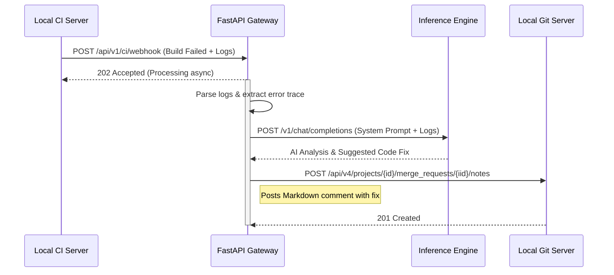

Here is the updated Technical Design Document (TDD). 

### Notes on Changes Made:
1.  **Document Version** updated to `1.1`.
2.  **Added Revision History** table to track changes.
3.  **Added Section 1.3 (Recommended Local Models):** Explicitly listed the exact open-source models to be hosted for Autocomplete, Chat/Reasoning, and Embeddings, including their parameters and VRAM footprints.
4.  **Added Section 5.1 (Hardware Requirements):** Detailed the minimum and recommended CPU, RAM, GPU, and Storage specifications required to run the selected local models efficiently.
5.  **Updated Section 5.2 (Docker Compose):** Adjusted the docker-compose file to reflect the hardware requirements (e.g., `deploy.resources.reservations.devices` for GPU allocation).

---

# Technical Design Document (TDD)
**Project Name:** Project Forge (Local AI Coding Agent)
**Document Version:** 1.1
**Role:** Lead Architect
**Date:** October 24, 2023

## Revision History
| Version | Date | Author | Description of Changes |
| :--- | :--- | :--- | :--- |
| 1.0 | Oct 24, 2023 | Lead Architect | Initial Draft. |
| **1.1** | **Oct 24, 2023** | **Lead Architect** | **Added specific local models to host (Sec 1.3) and detailed hardware requirements (Sec 5.1) based on stakeholder feedback.** |

---

## 1. System Architecture Overview

To satisfy the strict air-gapped constraints and provide a seamless developer experience, Project Forge will utilize a hub-and-spoke architecture. A central **FastAPI Gateway** will orchestrate requests between the IDE clients, the CI/CD pipeline, the Vector Database (RAG), and the LLM Inference Engine.

### 1.1. High-Level Component Diagram

```text
[ IDE Clients (VS Code / JetBrains) ]  <-- (Continue.dev Extension)
        |
        | (OpenAI-Compatible REST API)
        v
+---------------------------------------------------+
|             Project Forge API Gateway             |
|                 (Python FastAPI)                  |
|                                                   |
|  +-------------+  +-------------+  +-----------+  |
|  | RAG Manager |  | CI Analyzer |  | LLM Proxy |  |
|  +-------------+  +-------------+  +-----------+  |
+---------------------------------------------------+
        |                 |                 |
        | (gRPC/REST)     | (REST)          | (REST)
        v                 v                 v
+---------------+ +---------------+ +-------------------+
|   ChromaDB    | | Local Git/CI  | | Inference Engine  |
| (Vector Store)| | (GitLab/Gitea)| |   (vLLM/Ollama)   |
+---------------+ +---------------+ +-------------------+
        |                                   |
        v                                   v
[ Local Codebase ]                  [ Local LLM Weights ]
```

### 1.2. Component Responsibilities
1.  **Project Forge API Gateway (FastAPI):** The central orchestrator. It exposes OpenAI-compatible endpoints for the IDEs, webhook endpoints for the CI server, and administrative endpoints for RAG indexing.
2.  **Inference Engine (vLLM / Ollama):** Dedicated solely to loading model weights into GPU VRAM and executing inference.
3.  **ChromaDB:** Stores code embeddings for RAG.
4.  **Local Git/CI Server:** Triggers webhooks on build failures and receives PR comments via its REST API.

### 1.3. Recommended Local Models
To balance speed, accuracy, and hardware constraints, the system will host three distinct models locally:

1.  **Autocomplete Model (FIM - Fill In the Middle):**
    *   **Model:** `Qwen2.5-Coder-1.5B` (or `StarCoder2-3B`)
    *   **Role:** Real-time code completion as the developer types.
    *   **Requirements:** Must have `< 400ms` latency. Consumes ~2-4GB VRAM.
2.  **Chat, Reasoning & CI Analysis Model:**
    *   **Model:** `DeepSeek-Coder-V2-Lite-Instruct` (16B MoE) or `Qwen2.5-Coder-7B-Instruct`
    *   **Role:** Handles complex IDE chat queries, RAG context synthesis, and CI/CD error log analysis.
    *   **Requirements:** High reasoning capability. Consumes ~12-16GB VRAM (quantized to 4-bit/8-bit if necessary).
3.  **Embedding Model (RAG):**
    *   **Model:** `nomic-embed-text` (v1.5) or `bge-m3`
    *   **Role:** Converts codebase chunks and user queries into vector embeddings for ChromaDB.
    *   **Requirements:** High retrieval accuracy for code. Consumes `< 1GB` VRAM.

---

## 2. API Specifications

The FastAPI Gateway will expose the following RESTful APIs. 

### 2.1. IDE Integration APIs (OpenAI Compatible)
To ensure out-of-the-box compatibility with `Continue.dev`, the Gateway will implement the standard OpenAI API contract, intercepting requests to inject RAG context when necessary.

#### 2.1.1. Code Autocomplete (FIM)
*   **Endpoint:** `POST /v1/completions`
*   **Description:** Proxies directly to the fast autocomplete LLM (`Qwen2.5-Coder-1.5B`). RAG is bypassed for speed.

#### 2.1.2. Chat & Contextual Q&A
*   **Endpoint:** `POST /v1/chat/completions`
*   **Description:** Handles chat requests. If the user asks a codebase-wide question, the Gateway intercepts the prompt, queries ChromaDB, injects the retrieved code snippets into the system prompt, and forwards it to the heavy LLM (`DeepSeek-Coder-V2-Lite`).

### 2.2. CI/CD Integration APIs

#### 2.2.1. CI Failure Webhook
*   **Endpoint:** `POST /api/v1/ci/webhook`
*   **Description:** Receives payload from the CI server when a pipeline fails. Triggers the asynchronous `CI Analyzer` task.

### 2.3. RAG & Admin APIs

#### 2.3.1. Trigger Repository Indexing
*   **Endpoint:** `POST /api/v1/rag/index`
*   **Description:** Instructs the Gateway to clone/pull a local repository, chunk the code, generate embeddings, and store them in ChromaDB.

---

## 3. Data Schemas

### 3.1. Chat Request Schema (IDE -> Gateway)
*Standard OpenAI Chat Completion format.*
```json
{
  "$schema": "http://json-schema.org/draft-07/schema#",
  "title": "ChatCompletionRequest",
  "type": "object",
  "properties": {
    "model": { "type": "string", "description": "e.g., deepseek-coder" },
    "messages": {
      "type": "array",
      "items": {
        "type": "object",
        "properties": {
          "role": { "type": "string", "enum": ["system", "user", "assistant"] },
          "content": { "type": "string" }
        },
        "required": ["role", "content"]
      }
    },
    "temperature": { "type": "number", "default": 0.2 },
    "stream": { "type": "boolean", "default": true }
  },
  "required": ["model", "messages"]
}
```

### 3.2. CI Webhook Payload Schema (CI -> Gateway)
*Generic schema adaptable to GitLab/Jenkins.*
```json
{
  "$schema": "http://json-schema.org/draft-07/schema#",
  "title": "CIWebhookPayload",
  "type": "object",
  "properties": {
    "event_type": { "type": "string", "enum": ["build_failed", "test_failed"] },
    "repository": {
      "type": "object",
      "properties": {
        "name": { "type": "string" },
        "url": { "type": "string", "description": "Local Git URL" }
      }
    },
    "pull_request_id": { "type": "integer", "description": "ID of the PR to comment on" },
    "commit_sha": { "type": "string" },
    "build_logs": { "type": "string", "description": "Truncated tail of the error log" },
    "failed_job_name": { "type": "string" }
  },
  "required": ["event_type", "repository", "pull_request_id", "build_logs"]
}
```

### 3.3. Vector Database Document Schema (ChromaDB)
```json
{
  "id": "repo_name/path/to/file.py#chunk_01",
  "embedding": "[... 384-dimensional float array ...]",
  "document": "def authenticate_user(token):\n    # code snippet...",
  "metadata": {
    "repo": "core-auth",
    "file_path": "src/auth.py",
    "language": "python",
    "start_line": 12,
    "end_line": 45
  }
}
```

---

## 4. Sequence Diagrams

### 4.1. CI/CD Automated Debugging Flow


---

## 5. Deployment & Infrastructure

### 5.1. Hardware Requirements
To run the Gateway, Vector DB, and the three local models concurrently with acceptable latency, the host server must meet the following specifications:

| Component | Minimum Requirement | Recommended (For Teams > 10 Devs) | Justification |
| :--- | :--- | :--- | :--- |
| **GPU** | 1x 24GB VRAM (e.g., RTX 3090 / 4090 / A10G) | 2x 24GB VRAM **OR** 1x 48GB VRAM (e.g., RTX 6000 Ada / A40) | Required to hold the 16B Chat model (~14GB), 1.5B Autocomplete model (~3GB), Embedding model (<1GB), and KV Cache for concurrent requests. |
| **CPU** | 8 Cores / 16 Threads | 16 Cores / 32 Threads | Handles concurrent API routing, Git cloning, and text chunking for RAG. |
| **RAM** | 32 GB DDR4 | 64 GB DDR5 | System memory for OS, ChromaDB in-memory operations, and Docker overhead. |
| **Storage** | 500 GB NVMe SSD | 1 TB+ NVMe Gen4 SSD | Fast read speeds are critical for loading `.gguf`/`.safetensors` weights into VRAM quickly upon restart, and for fast ChromaDB vector retrieval. |

### 5.2. Docker Compose Configuration (Air-Gapped)
The entire stack will be deployed via a single `docker-compose.yml` file on the lab's GPU server.

```yaml
version: '3.8'
services:
  inference-engine:
    image: vllm/vllm-openai:latest # Transferred via USB
    deploy:
      resources:
        reservations:
          devices:
            - driver: nvidia
              count: all
              capabilities: [gpu]
    ports:
      - "8000:8000"
    volumes:
      - /mnt/data/models:/models
    # Example command loading the primary chat model. 
    # Note: In production, a secondary vLLM container or Ollama instance will run on port 8001 for the 1.5B autocomplete model.
    command: --model /models/DeepSeek-Coder-V2-Lite-Instruct.gguf --max-model-len 8192 --gpu-memory-utilization 0.85

  chromadb:
    image: chromadb/chroma:latest # Transferred via USB
    ports:
      - "8001:8000"
    volumes:
      - chroma-data:/chroma/chroma

  forge-gateway:
    build: ./gateway
    ports:
      - "8080:8080"
    environment:
      - CHAT_LLM_URL=http://inference-engine:8000
      - AUTOCOMPLETE_LLM_URL=http://inference-engine:8001
      - CHROMA_URL=http://chromadb:8000
      - GIT_API_TOKEN=${GIT_API_TOKEN}
    depends_on:
      - inference-engine
      - chromadb

volumes:
  chroma-data:
```

### 5.3. Air-Gap Model Ingestion Protocol
Because the server has zero internet access, model updates must follow this strict protocol:
1.  **Download:** DevOps downloads `.gguf` or `.safetensors` files from HuggingFace on an internet-connected terminal.
2.  **Scan:** Files are scanned using the lab's approved malware/hash verification tools.
3.  **Transfer:** Files are moved to a secure USB drive or via a unidirectional network gateway (data diode) to the lab's internal network.
4.  **Mount:** Files are placed in `/mnt/data/models` on the GPU server.
5.  **Restart:** The `inference-engine` container is restarted to load the new weights into VRAM.

---

## 6. Error Handling & Fallbacks

1.  **OOM (Out of Memory) on GPU:** 
    *   *Handling:* vLLM will be configured with `--gpu-memory-utilization 0.85` to prevent hard crashes. If context length exceeds limits, the Gateway will truncate the oldest RAG context before sending it to the LLM.
2.  **CI Log Too Large:**
    *   *Handling:* The Gateway will truncate CI logs to the last 3,000 tokens (approx. 12,000 characters) to ensure it fits within the LLM's context window without displacing the system prompt.
3.  **RAG Database Unreachable:**
    *   *Handling:* The Gateway will catch the timeout, log a warning, and forward the user's chat request to the LLM *without* context, ensuring the chat feature remains functional even if search is degraded.